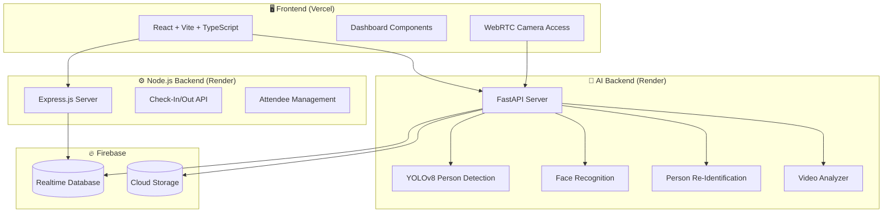

<p align="center">
  
</p>

<h1 align="center"> Echoplex</h1>
<h3 align="center">AI-Powered Event Safety Intelligence Platform</h3>

<p align="center">
  <strong>Real-time crowd monitoring, lost person detection, and intelligent safety management for large-scale events</strong>
</p>

<p align="center">
  <a href="https://echoplex-ai-event-safety-platform-s.vercel.app">🌐 Live Demo</a> •
  <a href="#features">✨ Features</a> •
  <a href="#architecture">🏗️ Architecture</a> •
  <a href="#installation">📦 Installation</a> •
  <a href="#deployment">🚀 Deployment</a>
</p>

---

## 🌟 Overview

**Echoplex** is a comprehensive AI-powered event safety platform that combines computer vision, real-time analytics, and intelligent crowd management to ensure safety at large-scale events like concerts, festivals, and conferences.

### 🎯 Key Capabilities

- **AI-Powered Person Detection** - YOLOv8 and facial recognition for real-time identification
- **Lost Person Tracking** - Register missing persons and scan video feeds or live cameras
- **Crowd Density Monitoring** - Real-time occupancy tracking with zone-based management
- **QR-Based Check-In System** - Digital attendance management with bulk import support
- **Real-Time Analytics Dashboard** - Live statistics and safety insights

---

## 🖼️ Screenshots

### Dashboard Overview
The main dashboard provides real-time event monitoring with attendee counts, zone occupancy, and safety alerts.

### Lost & Found Module
AI-powered missing person detection using video analysis and live camera scanning.

---

## 🏗️ Architecture



---

## 🛠️ Tech Stack

### Frontend
| Technology | Purpose |
|------------|---------|
| React 18 | UI Framework |
| TypeScript | Type Safety |
| Vite | Build Tool |
| TailwindCSS | Styling |
| Lucide React | Icons |
| React Webcam | Camera Access |

### Node.js Backend
| Technology | Purpose |
|------------|---------|
| Express.js 5 | API Server |
| TypeScript | Type Safety |
| CORS | Cross-Origin Support |
| Firebase Admin | Database Access |

### AI Backend
| Technology | Purpose |
|------------|---------|
| FastAPI | API Framework |
| Ultralytics YOLOv8 | Person Detection |
| OpenCV | Image Processing |
| face_recognition | Facial Recognition |
| ChromaDB | Vector Database |
| PyTorch | Deep Learning |

### Infrastructure
| Service | Platform |
|---------|----------|
| Frontend Hosting | Vercel |
| Backend Hosting | Render |
| Database | Firebase Realtime DB |
| Storage | Firebase Storage |

---

## ✨ Features

### 🎫 Check-In Management
- **Manual Check-In/Out** - Ticket ID based entry management
- **Bulk Import** - CSV upload for 10,000+ attendees
- **QR Code Scanning** - Zone-specific QR codes for entry points
- **Real-Time Status** - Live attendance tracking

### 🔍 Lost & Found AI
- **Case Registration** - Report missing persons with photos and descriptions
- **Video Analysis** - Upload video files for AI scanning
- **Live Camera Scan** - Real-time webcam detection
- **Clothing Color Matching** - Smart attribute-based search
- **WebSocket Notifications** - Instant match alerts

### 📊 Crowd Analytics
- **Zone Monitoring** - Capacity tracking per zone
- **Density Heatmaps** - Visual crowd distribution
- **Risk Assessment** - Automated safety alerts
- **Predictive Analytics** - ML-powered crowd forecasting

### 🛡️ Safety Features
- **Real-Time Alerts** - Instant notifications for safety issues
- **Incident Management** - Log and track safety incidents
- **Emergency Protocols** - Quick-action safety responses

---

## 🚀 Deployment

### Live URLs

| Service | URL | Status |
|---------|-----|--------|
| **Frontend** | [echoplex-ai-event-safety-platform-s.vercel.app](https://echoplex-ai-event-safety-platform-s.vercel.app) | ✅ Live |
| **Node.js API** | [echoplex-node-backend.onrender.com](https://echoplex-node-backend.onrender.com) | ✅ Live |
| **AI API** | [echoplex-ai-backend.onrender.com](https://echoplex-ai-backend.onrender.com) | ✅ Live |

> ⚠️ **Note:** Free-tier Render services may have cold starts (~30-60 seconds) after periods of inactivity.

---

## 📦 Installation

### Prerequisites
- Node.js 18+
- Python 3.10+
- npm or yarn

### Clone the Repository
```bash
git clone https://github.com/Chaitralikore/Echoplex-AI-Event-Safety-Platform.git
cd Echoplex-AI-Event-Safety-Platform
```

### Frontend & Node.js Backend Setup
```bash
# Install dependencies
npm install

# Start development servers (Frontend + Node.js Backend)
npm run dev:full
```

### AI Backend Setup
```bash
# Navigate to AI backend
cd ai_backend

# Create virtual environment
python -m venv venv
source venv/bin/activate  # On Windows: venv\Scripts\activate

# Install dependencies
pip install -r requirements.txt

# Start AI server
python main.py
```

### Environment Variables

Create a `.env` file in the root directory:

```env
# Frontend (Vite)
VITE_API_URL=http://localhost:3000/api
VITE_AI_BACKEND_URL=http://localhost:8002

# Firebase (already configured in code)
VITE_FIREBASE_API_KEY=your_api_key
VITE_FIREBASE_AUTH_DOMAIN=your_auth_domain
VITE_FIREBASE_PROJECT_ID=your_project_id
```

---

## 📁 Project Structure

```
Echoplex-AI-Event-Safety-Platform/
├── src/                          # Frontend React application
│   ├── components/               # React components
│   │   ├── Dashboard.tsx         # Main dashboard
│   │   ├── LostAndFound.tsx      # Lost person module
│   │   ├── CheckInSection.tsx    # Check-in management
│   │   ├── CrowdMonitor.tsx      # Crowd analytics
│   │   └── ...
│   ├── services/                 # API services
│   ├── firebase.ts               # Firebase configuration
│   └── App.tsx                   # Root component
│
├── Server/                       # Node.js Express backend
│   ├── Server.ts                 # Express server
│   └── routes/                   # API routes
│
├── ai_backend/                   # Python FastAPI AI backend
│   ├── main.py                   # FastAPI application
│   ├── person_detector.py        # YOLO detection
│   ├── video_analyzer_v2.py      # Video analysis
│   └── requirements.txt          # Python dependencies
│
├── render.yaml                   # Render deployment config
├── package.json                  # Node.js dependencies
└── README.md                     # This file
```

---

## 🔌 API Endpoints

### Node.js Backend (`/api`)

| Method | Endpoint | Description |
|--------|----------|-------------|
| POST | `/attendees/bulk-import` | Import attendees from CSV |
| POST | `/attendees/check-in` | Check in attendee |
| POST | `/attendees/check-out` | Check out attendee |
| GET | `/attendees/status/:ticketId` | Get attendee status |
| DELETE | `/attendees/clear/:eventId` | Clear all attendees |

### AI Backend

| Method | Endpoint | Description |
|--------|----------|-------------|
| POST | `/api/register-case` | Register missing person |
| POST | `/api/analyze-video` | Analyze video for matches |
| POST | `/api/scan` | Live camera frame scan |
| GET | `/api/cases` | Get all registered cases |
| WS | `/ws/notifications` | Real-time match alerts |
| GET | `/health` | Health check |

---

## 🧠 AI Models

### YOLOv8 (Person Detection)
- **Model:** `yolov8n.pt` (Nano - optimized for speed)
- **Purpose:** Real-time person detection in video frames
- **Fallback:** OpenCV HOG detector for low-resource environments

### Face Recognition
- **Library:** `face_recognition` (dlib-based)
- **Purpose:** Facial encoding and matching
- **Accuracy:** 99.38% on LFW benchmark

### Person Re-Identification
- **Features:** Clothing color analysis, height estimation
- **Matching:** Multi-attribute similarity scoring

---

## 📊 Performance

| Metric | Value |
|--------|-------|
| Person Detection | ~30 FPS (YOLOv8n) |
| Face Encoding | ~100ms per face |
| Video Analysis | ~5-10 FPS processing |
| Match Threshold | 70% confidence |

---

## 🤝 Contributing

Contributions are welcome! Please feel free to submit a Pull Request.

1. Fork the repository
2. Create your feature branch (`git checkout -b feature/AmazingFeature`)
3. Commit your changes (`git commit -m 'Add some AmazingFeature'`)
4. Push to the branch (`git push origin feature/AmazingFeature`)
5. Open a Pull Request

---

## 📄 License

This project is licensed under the MIT License - see the [LICENSE](LICENSE) file for details.

---

## 👨‍💻 Author

**Chaitrali Kore**

- GitHub: [@Chaitralikore](https://github.com/Chaitralikore)

---

<p align="center">
  Made with ❤️ for safer events
</p>

<p align="center">
  
  
  
  
  
</p>
